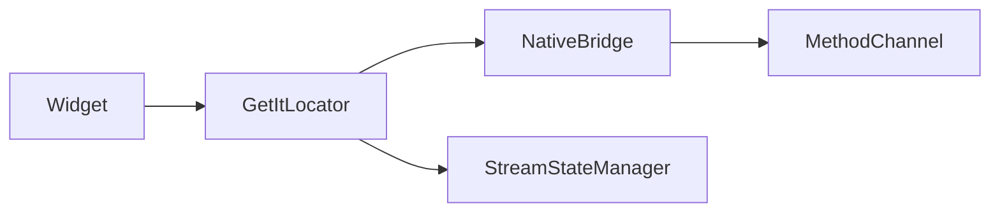

# Service Locator Native

Minimal demo combining GetIt service location with platform channel communication.

Widgets resolve services from the locator instead of constructor injection trees.

Includes stream-based state management wired to native callbacks.

## Structure



## Stack

| Technology | Version |
|------------|---------|
| Dart SDK | ^3.13.3 |
| cupertino_icons | ^1.0.8 |
| flutter_lints | ^6.0.0 |
| Android Gradle Plugin | 9.1.0 |
| Kotlin | 2.4.0 |
| compileSdk / targetSdk | 36 |
| minSdk | 29 |
| JVM | 25 |
| iOS Deployment Target | 15.0 |
| Swift | 5.0 |

## Architecture

```
lib/
    ├── main.dart
    ├── service_locator.dart
    └── stream_state_management.dart
```

## Coverage

flutter pub run build_runner build --delete-conflicting-outputs

flutter test --coverage

genhtml coverage/lcov.info -o coverage/html

open coverage/html/index.html

## ScreenShots

| Image 1 | Image 2 | Image 3 |
|----------|----------|----------|
|  |  |  |

| Image 4 | Image 5 | Image 6 |
|----------|----------|----------|
|  |  |  |

## Commits

```
git add . && git commit -m ":rocket: Initial commit." && git push
git add . && git commit -m ":building_construction: Added initial project architecture." && git push
git add . && git commit -m ":building_construction: Update project architecture." && git push
git add . && git commit -m ":memo: Updated project documentation." && git push
git add . && git commit -m ":memo: Updated code documentation." && git push
git add . && git commit -m ":white_check_mark: Added feature xyz." && git push
git add . && git commit -m ":wrench: Fixed xyz usage." && git push
git add . && git commit -m ":heavy_minus_sign: Removed xyz." && git push
git add . && git commit -m ":memo: Adjusted project imports." && git push
git add . && git commit -m ":arrow_up: Updated dependencies." && git push
git add . && git commit -m ":arrow_down: Removed dependencies." && git push
git add . && git commit -m ":wastebasket: Removed unused code." && git push
git add . && git commit -m ":test_tube: Added test functionality xyz." && git push
git add . && git commit -m ":construction_worker: Building in progress." && git push
git add . && git commit -m ":construction_worker: Added CI build system." && git push
```

## License

[MIT License](https://opensource.org/licenses/MIT)

Copyright (c) 2026 William Franco.

